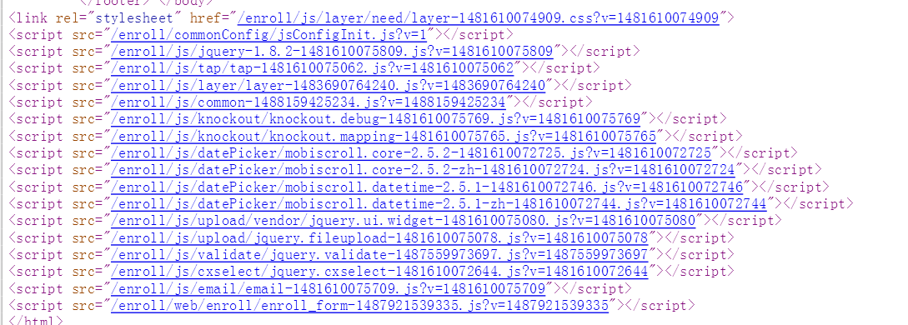
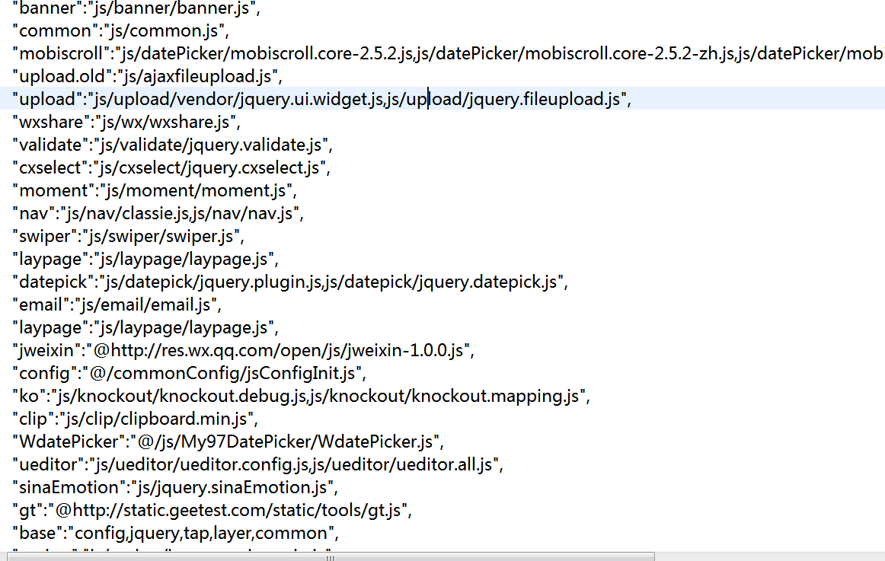
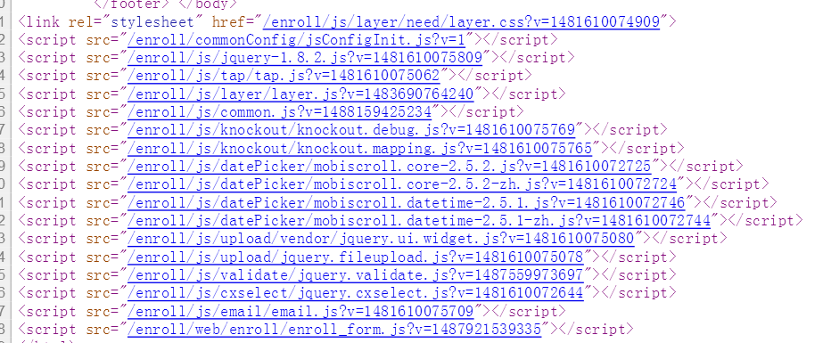

#js,css自动压缩和依赖管理

## 简介
> 相关代码在maven库中
        
        <dependency>
			<groupId>com.vonchange</groupId>
			<artifactId>util</artifactId>
			<version>1.0-SNAPSHOT</version>
		</dependency >
>  写法与使用
  

 1. 使用freemarker或者jsp均可,这里演示freemarker的实现
     > 写法为 
[@js src="base,ko,mobiscroll,upload,validate,cxselect,email,web/enroll/enroll_form.js"/]
同理 css写法为:
 [@css src="web/css/new_head_foot.css,web/css/style.css,mobiscroll"/]
最终会解释为

 > 

### 相关配置文件为
   > 
> 极大的简化了js,和css引入的写法,且会自动加入时间戳,可以设置js,css成永久缓存,配置文件可以写依赖而不会重复加载.将相关js,css配置写在文件里,容易管理和统一js版本.

### 可以直接压缩版和源码之间切换
   > 通过后门接口 改变其属性可以 使代码变成源码,便于线上调试.
   > 